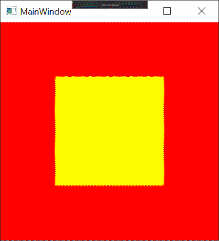

# Tedd.WritableBitmap
```c#
var bitmap = new Tedd.WriteableBitmap(100, 100, PixelFormats.Bgra32);
var red = WriteableBitmap.FromRgba(255, 0, 0, 255);
var yellow = WriteableBitmap.FromColor(Colors.Yellow);
// Calculation is: ((UInt32) a << 24) | ((UInt32) r << 16) | ((UInt32) g << 8) | (UInt32)b
// Note that despite format being Bgra32 WPF wants ARBG. 

// Use spain pointer to fill image with red
var spanPtr = bitmap.ToSpanUInt32();
for (var i = 0; i < spanPtr.Length; i++)
{
    spanPtr[i] = red;
}
// Might as well use Span's Fill-function though. Much faster.
spanPtr.Fill(red);

// This requires us to compile with unsafe, and set method unsafe or surround with unsafe block.
var ptr = bitmap.ToUnsafeUInt32(out var len);
// ptr is a raw pointer to memory area. Nobody is holding your hand here telling you to stop.
// Our memory is ptr[0] to ptr[len-1]. If we go outside of this it is very bad!

// Lets paint a square.
for (var x = 25; x < 75; x++) {
    for (var y = 25; y < 75; y++)
    {
        // Finding the index of a position is calculated as:
        //var i = y * bitmap.Width + x;
        // The helper function GetIndex() will do this for you
        var i = bitmap.GetIndex(x, y);
        ptr[y] = yellow;
    }
}
```
You can databind WriteableBitmap directly into an Image in WPF. Make sure your image is a property put into a class that is DataContext. Databind to the "BitmapSource" property under the WriteableBitmap.

```xaml
<Window x:Class="SomeApp.MainWindow"
        xmlns="http://schemas.microsoft.com/winfx/2006/xaml/presentation"
        xmlns:x="http://schemas.microsoft.com/winfx/2006/xaml"
        xmlns:d="http://schemas.microsoft.com/expression/blend/2008"
        xmlns:mc="http://schemas.openxmlformats.org/markup-compatibility/2006"
        xmlns:local="clr-namespace:SomeApp"
        mc:Ignorable="d"
        Title="MainWindow" Height="450" Width="800">
    <Grid>
        <Image Source="{Binding Bitmap.BitmapSource }" ></Image>
    </Grid>
</Window>
```

Result



# Speed

Why is this faster than [System.Windows.Media.Imaging.WriteableBitmap](https://docs.microsoft.com/en-us/dotnet/api/system.windows.media.imaging.writeablebitmap)?

## Overflow check

.Net is all about safety. Safety comes at a cost.

Lets take this simple example, we modify one element in the array.

```c#
public byte[] array;
public void ModifyIt() {
    array[5] = 1;
}
```
This compiles down to:

```asm
L0000: mov eax, [ecx+4]          // Get array object address
L0003: cmp dword ptr [eax+4], 5  // Compare length of array with index element we are accessing (5)
L0007: jbe short L000e           // If array is smaller than our index, jump to L000e
L0009: mov byte ptr [eax+0xd], 1 // Set (address+8+5*element_size) to 1
L000d: ret
L000e: call 0x0fa32000           // Throw exception
L0013: int3
```


Lets do the same with an unsafe pointer.

```c#
public byte* array;
public void ModifyIt() {
    array[5] = 1;
}
```
This compiles to:

```assembly
L0000: mov eax, [ecx+4]			// Get base address pointing directly to data
L0003: mov byte ptr [eax+5], 1  // Set (address+5) to 1
L0007: ret
```
You don't have to understand exactly what is going on here, the short version is: Fewer instructions, no branching. The slightly longer explanation is that when accessing an array, .Net will check every access you make (read or write) to ensure you are not out of bounds. This holds true even with Span&lt;T&gt;.

If you ware willing to take on some risk you can get some reward.

## .Net objects / Garbage collect

Memory management is a complex field. It mainly boils down to memory limits and fragmentation. .Net uses Garbage Collector to maintain memory and keep a lookup-table for objects. GC may defragment memory, and the address of objects may change at any time. So without pinning an object, accessing a the object directly by pointer is not advisable.

A way to bypass this is to allocate memory directly from the operating system. This memory is then not an object for GC to move around, but instea simply a pointer. This it however comes at a risk of writing outside of the allocated memory region, but that is easy to fix by a few simple overflow checks.

## Summary

Memory can be accessed faster by using unmanaged memory allocated from the operating system. It can further be accessed even faster by accepting the risk of writing outside of the memory area (overflow).

